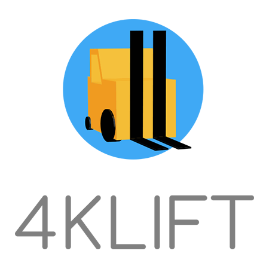

4klift (Forklift) Framework
===========================

## Introduction

**4klift** is a set of PHP components for developing highly available, redundant and scalable web sites or services on top of Apache Cassandra.

Cassandra makes **4klift** well suited for server side applications requiring greater than 99.99% service availability while also being able to withstand up to millions of read and write operations per second.

This framework of components can be used together or individually. Many components may be used individually in a variety of other frameworks, including Symfony, Silex, Laraval and Drupal.

### No Code Yet.

We are in the process of preparing some of our libraries for open source. This development VM is also a work-in-progress and may result in additional packages installed on provision and eventually a new base box with many of the provisioned requirements pre-installed. However, this remains a useful VM for high performance web development.

We target software that can run on CentOS 6.7. **4klift** is required to run on a wide range of enterprise systems that may be venerable in internet years, but very stable. However, these are simply minimal requirements; every effort is taken to ensure **4klift's** ability to run on modern distributions.

To use the latest dev version, use the *dev-master* branch.

## 4klift Requires:

  - [Composer](https://getcomposer.org/ "Composer")
  - [Vagrant](https://www.vagrantup.com/ "Vagrant")
  - [VirtualBox](https://www.virtualbox.org/ "VirtualBox")

## The Development Environment

**4klift** requires Vagrant and VirtualBox. This development virtual machine works on Mac, Windows and most Linux variants. Install for the appropriate platform:

  - [Vagrant](https://www.vagrantup.com/downloads.html "Download Vagrant")
  - [VirtualBox](https://www.virtualbox.org/wiki/Downloads "Download VirtualBox")

Provisioning the VM will require the vagrant-vbguest plugin.
   
    vagrant plugin install vagrant-vbguest

If you have a Mac, you can use Homebrew to install.

If you do not have Homebrew:

    /usr/bin/ruby -e "$(curl -fsSL https://raw.githubusercontent.com/Homebrew/install/master/install)"

Install Virtualbox and Vagrant with `brew`:

    brew cask install virtualbox
    brew cask install vagrant

## Installing the 4klift Base Project

Navigate to or create a project directory. Run:
    
    composer create-project -s dev deasilworks/4klift 4klift dev-master

This will clone the project and create a 4klift directory pointing to the *dev-master* branch. CD into the directory and fire up vagrant:

    cd 4klift
    vagrant up
    vagrant ssh

This will load all composer dependencies. Answer yes to the "Do you want to remove the existing VCS (.git, .svn..) history?" prompt.

When running, browse to `http://localhost:8080`.
Or, add the following line to your workstation's *hosts* file:

    192.168.222.11 4klift.vm.deasil.works

... and browse to `http://4klift.vm.deasil.works`.

## What's on the Virtual Machine?

The 4klift development VM currently consists of the following packages:

  - [CentOS 6.7](https://www.centos.org/)
  - [java-1.8.0-openjdk](http://openjdk.java.net/)
  - [Apache Cassandra 3.9.0 (CQL spec 3.4.2) (datastax-ddc)](https://academy.datastax.com/planet-cassandra/cassandra)
  - [cqlsh 5.0.1](http://docs.datastax.com/en/cql/3.3/cql/cql_reference/cqlsh.html)
  - [NGINX 1.10.2](https://nginx.org/en/)
  - [PHP 5.6.31](http://php.net/) / [php-fpm](https://php-fpm.org/)
  - [Composer >=1.4.2](https://getcomposer.org/)
  - [PHPUnit 5.7.21](https://phpunit.de/)
  - [NodeJS 6.11.1](https://nodejs.org/en/)
  - [npm 3.10.10](https://www.npmjs.com/)
  - [Sass 3.4.25](http://sass-lang.com/)
  - [Bower 1.8.0](https://bower.io/)
  - [Yarn 0.27.5](https://yarnpkg.com/en/)
  - [git 1.7.1](https://git-scm.com/)

## Contributing to 4klift

If you'd like to contribute to the **4klift** project, create component libraries, etc., you can fork and clone the project.

- **[How to Contribute to 4klift](docs/CONTRIBUTING.md "Contributing to 4klift")**
- **[4klift Logos and Assets](assets/README.md "4klift Logos and Assets")**

##### This open-source project is brought to you by [Deasil Works, Inc.](http://deasil.works/) Copyright &copy; 2017 Deasil Works, Inc.

    
